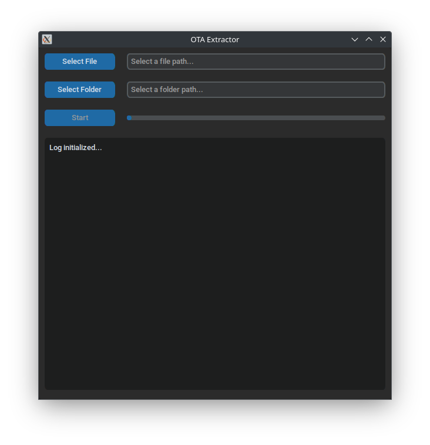

# OTA Extractor

OTA Extractor is a simple GUI tool for extracting OTA update contents (.zip and .bin files). It supports automatic system language detection (English/Russian).

📌 Features

✅ User-friendly interface — built with CustomTkinter.

✅ Supports .zip and .bin — automatically detects the format.

✅ Progress bar — visual indicator of the process.

✅ Logging system — real-time log with scrolling.

✅ Auto language detection — supports English and Russian.

---

📦 Installation

🔹 1. Clone the repository
 ```sh
git clone https://github.com/username/ota-extractor.git
cd ota-extractor
```
🔹 2. Install dependencies
> 📌 Requires Python 3.8+
```sh
pip install -r requirements.txt
```

---

🚀 Run

```sh
python main.py
```

---

🔧 Usage

1️⃣ Select an OTA file (.zip or .bin).

2️⃣ Choose a folder to extract contents.

3️⃣ Click "Start" — the process will begin, and progress will be logged.

4️⃣ Once finished, a success message will appear.

---



---

⚙ Project Structure

```bash
ota-extractor/
│── main.py                # Application entry point
│── ui.py                  # GUI logic
│── localization.py        # Language translations (RU / EN)
│── file_manager.py        # File selection logic
│── ota_extractor.py       # OTA extraction logic
│── progress_handler.py    # Progress bar handler
│── requirements.txt       # Dependencies
│── README.md              # Project documentation

```

---

## 🔄 Fork Information
This is a fork of [Original Project](https://github.com/cyxx/extract_android_ota_payload) by cyxx.
Major modifications include:
- New GUI using CustomTkinter
- Improved logging system
- Added multi-language support
